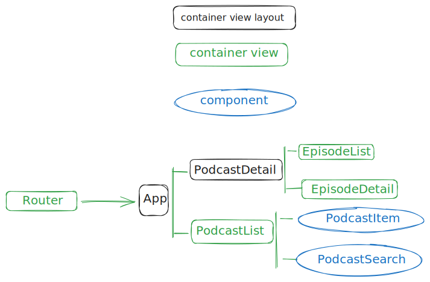

# Podcaster app

[React](https://es.react.dev/) based app powered by [vitejs](https://vitejs.dev/) that shows you a bunch of Itunes library podcasts, allowing you to filter by name and listen them in a detail page.

The app is built on top of [React-Router](https://reactrouter.com/en/main), and uses basic [React](https://es.react.dev/) state management in order to keep it simple, and [TailwindCSS](https://tailwindcss.com/) for styling.

File structure is ordered following clean arquitecture patterns, concretly feature pattern arquitecutre where we split the main views following a feature based criteria that keep us away of deps coupling, allowing us scaling up the app with easeness while keeping a clean and easy to follow adding pattern.

[Live demo](https://podcasterapp.netlify.app/)

## Branchs

- main with custom cache system
- f/with-react-query with react-query as cache & fetching system

## Development

Requirements:

- Node.js 18
- [PNPM](https://pnpm.io/) 8

## How to run it ?

Main commands:

- `bash pnpm install ` to install respository dependencies
- `bash pnpm dev` to start developemt server
- `bash pnpm build:dev` to get a build version without minification and with source maps
- `bash pnpm build:prod` to get a prod version with asset minification

## Testing

the app uses Vitest as main testing tool and Cypress as e2e framework.
Basic test setup:

- `bash pnpm test` for unit testing
- `bash pnpm test:e2e` for end to end testing

## Arquitectura

La arquitecutra de la aplicación usa el patrón cualidades o caracteristicas (feature pattern en ingés), una modalidad de arquitecura limpia que nos permite dividir la app en función de la lógica que desempeña cada parte, dividiendo las responsabilidades en módulos que nos facilitan el escalado de la app, así como la legibilidad del código del proyecto.

Dado que en este caso la lógica de dominio de la app se remite prácticamente a mostrar información, vamos a utilizar un mix de este patrón con lo que nos propone la biblioteca react-router de manera opinada, que consistirá en la división de la app siguiendo la configuración de enrutamiento, de manera que cada una de las rutas será vinculada con una vista o componente contenedor de React que se engarcagrá de gestionar el flujo de datos de todos sus componentes desdcendentes. Será aquí donde se hagan las llamadas a la api, o donde se instale algún provider en el caso de que los necesitáramos. Todo esto bajo un único componente provider que se encargará de proveernos de todos las utilidades que nos brinda React-router

Así mismo la app dispondrá de un módulo global que proveerá de las interfaces necesáreas que son consideradas de uso global para cualquier parte de la aplicación. Esta parte global contendrá las siguientes carpetas:

- components: componentes que pueden ser usados en cualquier parte de la aplicación. Suelen ser componentes sin estado que solo reciven props y muestran partes de la vista que pueden ser reutilizabes.
- lib: esta carpetá contendrá un conjunto de utilidades y bibliotecas que son susceptibles de poder usarse en cualquier parte de la aplicación
- hooks: contendra todos los hooks cuya funcionalidad sea susceptible de poder ser reutilizable en cualquier componente del proyecto

Además cada módulo podrá contener sus propias interfaces inherentes a la responsabilidad que representa, para poder asistirse de toda la funcionalidad que necesite y que solo serán usadas pos las vistas y componentes que lo integran. La respresentación como ficheros sería la siguiente:

- Directorio views: Contendrá una vista o componente contenedor de React que además sirve como componente layout para React-router. En nuestro caso tenemos dos, para representar el anidamiento de rutas dentro de nuestra configuración de enrutado.
- \*.loader: son los ficheros donde expondremos las funciones engarcadas de la carga de datos.
- \*.util: En estos ficheros se incluirán todas las funcionalidades que sean de utilidad para la lógica que se desarrolla en el módulo.
- \*.test: Los ficheros acabados en esta terminación contendrán siempre el mismo nombre que cualquier fichero que integre el módulo para representar que es en este fichero donde se testeará sus funcionalidades.
- Components: directorio donde se crearán los componentes sin estado que serán reutilizables en este módulo.
- Hooks: directorio donde escribiremos cualquier hook de React que nos permita reutlizar funcionalidad en cuaquier vista o componente perteneciente a este módulo.
